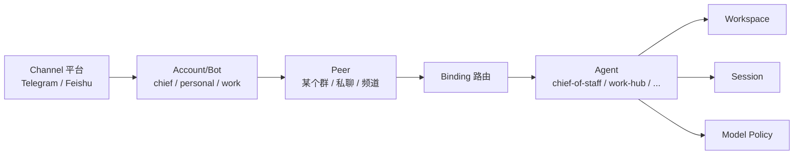
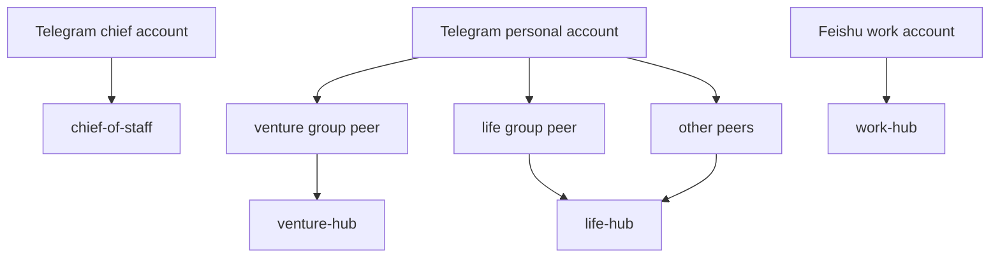
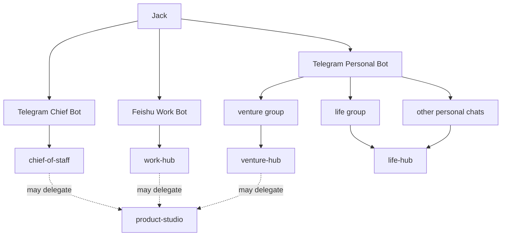
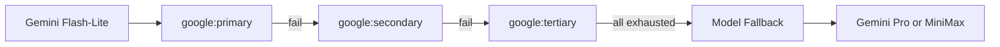

# OpenClaw 个人数字人体系设计文档（V1.0 基线版）

> 文档目的：
> 把本轮完整讨论沉淀为一份可复盘、可分享、可继续迭代的系统设计文档。
> 目标不是做“几个会聊天的 bot”，而是逐步建立一套**长期稳定、边界清晰、可持续演进的高级数字人体系**。
> 当前版本聚焦 **第一阶段可落地生产版**，为后续升级到更完整的数字人系统打地基。

---

# 目录

- [1. 文档定位](#1-文档定位)
- [2. 背景与设计动机](#2-背景与设计动机)
- [3. 当前阶段的核心目标](#3-当前阶段的核心目标)
- [4. 不做什么：反过度设计原则](#4-不做什么反过度设计原则)
- [5. OpenClaw 的关键技术理解](#5-openclaw-的关键技术理解)
- [6. 本系统的总体设计思想](#6-本系统的总体设计思想)
- [7. 第一阶段目标架构](#7-第一阶段目标架构)
- [8. 多 Agent 设计逻辑](#8-多-agent-设计逻辑)
- [9. IM、Bot、Channel、Account、Peer、Agent 的关系](#9-imbotchannelaccountpeeragent-的关系)
- [10. 路由与绑定设计](#10-路由与绑定设计)
- [11. 会话与隔离设计](#11-会话与隔离设计)
- [12. 记忆体系设计](#12-记忆体系设计)
- [13. 模型层设计](#13-模型层设计)
- [14. 安全设计与 Secrets 管理](#14-安全设计与-secrets-管理)
- [15. 工作区文件体系设计](#15-工作区文件体系设计)
- [16. 第一阶段配置方案](#16-第一阶段配置方案)
- [17. Codex / Gemini CLI 接管策略](#17-codex--gemini-cli-接管策略)
- [18. 需要人类亲手完成的任务](#18-需要人类亲手完成的任务)
- [19. 验收标准](#19-验收标准)
- [20. 当前版本的边界、风险与已知不足](#20-当前版本的边界风险与已知不足)
- [21. 第二阶段与更高级数字人体系的演进路线](#21-第二阶段与更高级数字人体系的演进路线)
- [22. 结论](#22-结论)
- [附录 A：关键文件模板思路](#附录-a关键文件模板思路)
- [附录 B：系统示意图](#附录-b系统示意图)
- [附录 C：术语表](#附录-c术语表)

---

# 1. 文档定位

这不是一份“随手记笔记”。

这是一份面向未来迭代的**系统设计基线文档**。
它承担三种角色：

1. **自我复盘文档**
   让系统主人未来回看时，能快速想起“为什么当初这么设计”。

2. **协作交接文档**
   可以直接发给 Codex、Gemini CLI、Cursor、Claude Code 等 coding agent，让其理解整体设计逻辑，而不是只拿到零散命令。

3. **对外分享文档**
   可以分享给朋友、同事、技术合作者，说明这套个人数字人体系的设计哲学、实现路径和演进思路。

---

# 2. 背景与设计动机

系统主人的真实诉求不是“多装几个 Agent 玩玩”，而是希望通过 OpenClaw 建立一套**长期可用的个人数字助理体系**，覆盖三大人生域：

- 正式工作
- 兼职创业 / AI 驱动的个人创业准备
- 个人生活、学习、成长、理财与事务管理

这三大域有明显差异：

| 维度 | 正式工作 | 创业准备 | 个人生活 |
|---|---|---|---|
| 目标导向 | 稳定交付、协作、结果负责 | PMF、实验、速度、试错 | 低摩擦、持续性、长期成长 |
| 信息属性 | 项目、客户、团队、组织信息 | 产品假设、商业模式、资源约束 | 财务、家庭、计划、习惯 |
| 风险等级 | 高 | 中高 | 中 |
| 输出风格 | 专业、稳健、可汇报 | 聚焦、试验、轻决策 | 简洁、可执行 |
| 适合的数字人角色 | 工作中枢 | 创业中枢 | 生活中枢 |

在这三域之上，还需要一个跨域角色，负责：

- 识别当前问题属于哪一域
- 做跨域协调
- 统筹长期目标
- 避免信息污染
- 充当总入口

这就是后来定义的 **`chief-of-staff`（数字参谋长）**。

---

# 3. 当前阶段的核心目标

当前阶段不是一步到位做“终极数字人王国”。
当前阶段目标非常明确：

> 在一台干净系统上，基于 OpenClaw，建立一套**第一阶段稳定可用**的个人数字人操作系统。

这套系统必须满足：

- 可以真实运行
- 结构清晰
- 不过度复杂
- 不依赖过多插件
- 不在主配置中暴露 secrets
- 可交给 AI coding agent 自动化完成大部分配置
- 可在此基础上持续迭代成更高级的数字人体系

---

# 4. 不做什么：反过度设计原则

本轮讨论中，已经明确了一条总原则：

> **最实用的，就是最好的。**

所以，第一阶段明确不做以下内容：

## 4.1 不上 mem0

原因：
- 当前不是必需
- 会增加记忆边界复杂度
- 多 Agent 场景下存在 memory bleed 风险
- Markdown memory 已足够作为第一阶段的 source of truth

## 4.2 不上 LCM / lossless-claw

原因：
- 当前不是必需
- 会增加 context engine 复杂度
- 当前目标是先跑稳 `legacy`
- LCM 更适合后期做上下文压缩增强，而不是第一阶段的主链路依赖

## 4.3 不接 WhatsApp

原因：
- 当前场景主要是 Feishu + Telegram
- WhatsApp 增加额外维护面
- 对当前设计价值不高

## 4.4 不让 specialist 成为前台主入口

原因：
- 前台入口过多会增加用户心智负担
- 让人自己充当“Agent 路由器”
- OpenClaw 更适合 bindings + 后台协作，而不是多个 bot 在前台抢活

## 4.5 不把 secrets 写进 `openclaw.json`

原因：
- 不符合生产安全最佳实践
- 后续 config patch / rewrite 存在把环境变量展开成明文的潜在风险
- 应采用 auth profile / 受控 secrets 注入机制

---

# 5. OpenClaw 的关键技术理解

这一部分是整个设计成立的基础。

---

## 5.1 OpenClaw 不是“几个 bot 的拼装”

OpenClaw 的正确理解方式是：

- 一个长期运行的 **Gateway**
- 多个隔离的 **Agent runtime**
- 多个接入的 **Channel**
- 通过 **Bindings** 把不同消息路由到不同 Agent
- 每个 Agent 拥有自己的 workspace、session store、agentDir

这意味着：

> 多 Agent 不是“一个脑子里切几个人格”，而是“多个隔离运行时共享一个入口控制平面”。

---

## 5.2 Channel、Bot、AccountId、Peer、Agent 的区别

很多误解都来自这几个概念混淆。

### Channel

渠道类型，例如：

- `telegram`
- `feishu`

它是平台，不是 bot。

### Bot / Account

在某个 channel 下的具体入口身份。
例如：

- Telegram `chief` bot
- Telegram `personal` bot
- Feishu `work` app / bot

在 OpenClaw 配置里通常体现为 `channels.<channel>.accounts.<accountId>`。

### Peer

某个具体会话对象，例如：

- 某个群
- 某个私聊对象
- 某个频道

`peer.id` 是最具体的路由粒度之一。

### Agent

真正处理消息的 AI 运行时。
一条消息一旦命中某个 agent，就意味着：

- 用它的 workspace
- 用它的记忆文件
- 用它的 session 上下文
- 用它的模型策略
- 用它的工具边界

---

## 5.3 路由顺序的关键理解

OpenClaw 的路由不是模糊推断，而是**确定性匹配**。

逻辑上应理解为：

```text
peer > accountId > channel > default agent
```

也就是说：

1. 最具体的 `peer` 匹配最优先
2. 再看 `accountId`
3. 再看 `channel`
4. 最后才落到默认 agent

这也是为什么：

- 同一个 Telegram bot 可以根据不同群路由到不同 agent
- `chief-of-staff` 适合作为默认兜底 agent，而不是“全平台唯一 bot”

---

## 5.4 Session 是上下文隔离容器

同一个 Agent，在不同 peer / 不同 channel / 不同 DM 下会形成不同 session。
这决定了上下文是否串台。

本次设计里明确采用：

```json
"session": {
  "dmScope": "per-channel-peer"
}
```

原因：

- 避免多个 DM 共用主 session
- 避免 Telegram 和 Feishu 上下文混淆
- 更适合多入口生产环境

---

## 5.5 Memory 的真正正本是什么

当前设计已经明确：

> **Markdown workspace memory 是唯一正本。**

也就是：

- `MEMORY.md`：长期稳定事实
- `memory/` 目录：后续可扩展为每日记录、专题记录、项目记录

这条非常关键，因为它让系统具备：

- 可审计性
- 可手工修正性
- 可迁移性
- 不依赖某个外部记忆插件

---

# 6. 本系统的总体设计思想

一句话总结：

> **不是做几个会聊天的 bot，而是建立一套“个人数字人操作系统”。**

它的结构不是扁平的，而是分层的。

---

## 6.1 分层设计思想

### 第一层：总控层

- `chief-of-staff`

负责：

- 总入口
- 域识别
- 跨域协调
- 总体统筹

### 第二层：三大人生域中枢

- `work-hub`
- `venture-hub`
- `life-hub`

负责：

- 各域长期上下文
- 各域内部任务承接
- 各域专属记忆边界
- 各域默认输出风格

### 第三层：后台 specialist

- `product-studio`

负责：

- 更高质量的结构化产品设计任务
- 不直接做前台入口
- 由 hub 或 chief-of-staff 背后调用

---

## 6.2 为什么不是“一 agent 一 bot”

因为那会导致：

- bot 数量膨胀
- 使用者自己变成路由器
- 记忆与权限边界更难控
- 群内交互复杂化

所以，本设计的原则是：

> **bot 少而清晰，agent 多而后台化。**

---

# 7. 第一阶段目标架构

## 7.1 Agent 列表

当前第一阶段只保留 5 个 Agent：

| Agent | 定位 | 是否前台 |
| --- | --- | --- |
| `chief-of-staff` | 总控数字参谋长 | 是 |
| `work-hub` | 正式工作中枢 | 是 |
| `venture-hub` | 创业准备中枢 | 是（通过 Telegram personal 某群） |
| `life-hub` | 生活中枢 | 是（通过 Telegram personal 某群/默认） |
| `product-studio` | 产品设计 specialist | 否 |

---

## 7.2 前台入口

| 平台 | Bot / Account | 作用 | 路由到 |
| --- | --- | --- | --- |
| Feishu | `work` | 工作主入口 | `work-hub` |
| Telegram | `chief` | 总控入口 | `chief-of-staff` |
| Telegram | `personal` | 创业 / 生活共用入口 | 按群分流 |

---

## 7.3 文本架构图

```text
                         ┌──────────────────────┐
                         │   OpenClaw Gateway   │
                         └──────────┬───────────┘
                                    │
                    ┌───────────────┼────────────────┐
                    │               │                │
                    ▼               ▼                ▼
             Feishu work     Telegram chief   Telegram personal
                    │               │                │
                    ▼               ▼                ▼
               work-hub       chief-of-staff   peer-based routing
                                                    │
                                      ┌─────────────┴─────────────┐
                                      ▼                           ▼
                                 venture-hub                  life-hub

后台 specialist:
- product-studio（由 chief-of-staff / work-hub / venture-hub 调用）
```

---

# 8. 多 Agent 设计逻辑

---

## 8.1 `chief-of-staff` 的角色

它不是“万能大脑”，而是：

- 默认入口
- 域识别器
- 统筹者
- 协调者
- 兜底 agent

它应当：

- 少做高风险执行
- 不主动吞并所有工作
- 优先判断任务属于哪个域
- 再决定是否需要 specialist

---

## 8.2 `work-hub`

这是正式工作的统一中枢。
负责接收：

- 产品设计任务
- 市场与传播任务
- 客户相关任务
- 团队与管理任务
- 工作类写作任务

它强调：

- 稳定
- 专业
- 贴近真实业务
- 适合汇报与协作

---

## 8.3 `venture-hub`

这是创业准备的统一中枢。
负责接收：

- 创业方向思考
- AI 产品探索
- PMF 设计
- MVP 路线
- 实验设计
- 商业模式探讨

它强调：

- 速度
- 聚焦
- 实验性
- 资源约束意识

---

## 8.4 `life-hub`

这是生活与成长的统一中枢。
负责接收：

- 日常事务
- 生活管理
- 理财与投资
- 学习与成长
- 长期个人计划

它强调：

- 低摩擦
- 清晰
- 稳健
- 可执行

---

## 8.5 `product-studio`

这是后台 specialist。
它不是一个“独立前台人格”，而是被调用的专业模块。

适合承接：

- PRD 结构设计
- 复杂产品方案分析
- 功能边界设计
- 产品路线推演
- 高质量结构化思考

---

# 9. IM、Bot、Channel、Account、Peer、Agent 的关系

这部分是整个系统最容易混淆、也最需要说清楚的地方。

---

## 9.1 关系图



---

## 9.2 关键认知

### 认知 1

**Bot 不是 Agent。**

Bot 只是 IM 世界中的入口身份。
Agent 才是 OpenClaw 世界里真正处理消息的运行时。

### 认知 2

**同一个 bot 可以服务多个 agent。**

只要通过 `peer` 做更细粒度路由，同一个 `accountId` 下的不同群，可以打到不同 agent。

### 认知 3

**default agent 不是“bot 的主人”，只是路由兜底。**

---

# 10. 路由与绑定设计

---

## 10.1 绑定逻辑

### Telegram `chief`

- 全部交给 `chief-of-staff`

### Telegram `personal`

- 创业群 -> `venture-hub`
- 生活群 -> `life-hub`
- 其余默认 -> `life-hub`

### Feishu `work`

- 全部交给 `work-hub`

---

## 10.2 绑定图



---

# 11. 会话与隔离设计

---

## 11.1 为什么要 `per-channel-peer`

如果不这样做，多个 DM 或多个平台的对话可能落到共享 session，造成：

- 上下文污染
- 个人信息串线
- 工作与生活混淆

所以本设计里明确：

```json
"session": {
  "dmScope": "per-channel-peer"
}
```

---

## 11.2 Agent 与 Session 的关系

每个 agent 都有自己的 session store。
每个 peer / channel 进入该 agent 后，会形成独立上下文容器。

这意味着：

- `work-hub` 不会天然继承 `life-hub` 的上下文
- `venture-hub` 不会天然读取 `work-hub` 的长期记忆
- 同一个 Telegram personal bot 的不同群，仍然可以通过 peer 分离为不同上下文

---

# 12. 记忆体系设计

---

## 12.1 当前阶段的记忆主张

> **不用 mem0，不用 LCM，Markdown memory 就够。**

---

## 12.2 记忆层次

### `MEMORY.md`

写长期稳定事实，例如：

- 该 Agent 的角色
- 核心目标
- 长期偏好
- 稳定边界

### `memory/`

当前阶段先创建目录，不强制大量写入。
后续可扩展为：

- `memory/YYYY-MM-DD.md`
- `memory/projects/...`
- `memory/people/...`
- `memory/finance/...`

---

## 12.3 为什么这样设计

原因有四个：

1. 清晰
2. 可手工维护
3. 不依赖外部插件
4. 对多 Agent 边界最友好

---

# 13. 模型层设计

---

## 13.1 模型分工

### 日常主力模型

- `google/gemini-3.1-flash-lite-preview`

用于：

- chief-of-staff
- work-hub
- venture-hub
- life-hub

原因：

- 成本更可控
- 适合高频任务
- 适合大多数日常调度与中等复杂度工作

### 高质量模型

- `google/gemini-3.1-pro-preview`

用于：

- `product-studio` 主模型
- `work-hub` / `venture-hub` 的高质量 fallback

原因：

- 更适合深度产品设计和复杂结构化输出

### 低成本保底模型

- `minimax/MiniMax-M2.7`

用于：

- 各 agent 的末级保底
- 跨 provider fallback

---

## 13.2 Gemini key 数量设计

当前系统的推荐值：

- 3 个 Gemini Paid key

命名为：

- `google:primary`
- `google:secondary`
- `google:tertiary`

这是一个平衡值：

- 比 1 个稳定
- 比 2 个更有冗余
- 又不会像 5~6 个那样增加过多运维负担

---

## 13.3 Provider 内部轮换优先

容错顺序是：

```text
同一 provider 内 auth profile 轮换
        ↓
全部 profile 不可用
        ↓
进入 model fallback
        ↓
最后切到 MiniMax
```

这条原则非常关键，因为它决定了：

- 不是“一撞限额就换 provider”
- 而是“先把 Google provider 的多个 key 用尽，再切模型”

---

## 13.4 当前推荐模型矩阵

| Agent | Primary | Fallback 1 | Fallback 2 |
| --- | --- | --- | --- |
| chief-of-staff | Gemini Flash-Lite | MiniMax M2.7 | - |
| work-hub | Gemini Flash-Lite | Gemini Pro | MiniMax M2.7 |
| venture-hub | Gemini Flash-Lite | Gemini Pro | MiniMax M2.7 |
| life-hub | Gemini Flash-Lite | MiniMax M2.7 | - |
| product-studio | Gemini Pro | Gemini Flash-Lite | MiniMax M2.7 |

---

# 14. 安全设计与 Secrets 管理

---

## 14.1 核心原则

> **真实 secrets 不进入 `openclaw.json`。**

---

## 14.2 为什么不能写进配置文件

如果把 API key、bot token、app secret 直接写入主配置文件，会带来：

- 明文暴露风险
- 配置文件泄漏风险
- 自动化 patch / diff 时泄漏风险
- 交给 Codex / Gemini CLI 时被二次读取风险

---

## 14.3 推荐方案

### 模型 API key

由人类手工使用：

```bash
openclaw models auth paste-token --provider google --profile-id "google:primary"
openclaw models auth paste-token --provider google --profile-id "google:secondary"
openclaw models auth paste-token --provider google --profile-id "google:tertiary"
openclaw models auth paste-token --provider minimax --profile-id "minimax:primary"
```

再设置顺序：

```bash
openclaw models auth order set --provider google google:primary google:secondary google:tertiary
openclaw models auth order set --provider minimax minimax:primary
```

### bot / app secrets

由人类采用本机安全方式注入，不交给 Codex 明文处理。

---

# 15. 工作区文件体系设计

---

## 15.1 每个 agent 至少有三类文件

- `SOUL.md`
- `AGENTS.md`
- `MEMORY.md`

---

## 15.2 它们各自负责什么

### `SOUL.md`

定义人格、边界、气质、基本定位。

### `AGENTS.md`

定义操作规则、职责边界、是否调用 specialist、禁止事项。

### `MEMORY.md`

定义这个 agent 的长期稳定事实，不写流水账。

---

## 15.3 为什么要简洁

因为这类文件会真实影响运行时上下文。
写得太长，会带来：

- prompt 膨胀
- 注意力分散
- 维护困难
- 信息过期后难以收敛

所以当前种子文件都保持简洁。

---

# 16. 第一阶段配置方案

---

## 16.1 `openclaw.json` 的核心字段

当前版本保留：

- `session.dmScope`
- `plugins.slots`
- `auth.order`
- `agents.list`
- `channels.accounts`
- `bindings`

---

## 16.2 当前配置意图

### `chief-of-staff`

- 默认 agent
- Telegram chief account 前台入口
- 总体统筹

### `work-hub`

- Feishu work 前台入口
- 正式工作域

### `venture-hub`

- Telegram personal 下创业群入口

### `life-hub`

- Telegram personal 下生活群入口
- Telegram personal 其他默认入口

### `product-studio`

- 后台 specialist
- 不直接暴露到前台

---

# 17. Codex / Gemini CLI 接管策略

---

## 17.1 AI coding agent 负责什么

- 备份
- 生成配置
- 创建目录
- 写种子文件
- 适配本机 OpenClaw 版本差异
- 重启 gateway
- 跑验证命令
- 输出实施报告

---

## 17.2 AI coding agent 不负责什么

- 不输入真实 secrets
- 不做人类专属操作
- 不扩大架构范围
- 不私自新增插件或 agent
- 不主动引入 mem0 / LCM / WhatsApp

---

## 17.3 最佳 handoff 方式

给 Codex 的材料应包含：

- 总任务 Prompt
- `USER.md`
- `SKILL.md`
- `openclaw.json.template`
- workspace seed files
- `bootstrap_openclaw_rebuild.sh`
- `RUNBOOK.md`

---

# 18. 需要人类亲手完成的任务

---

## 18.1 系统层

- 准备干净服务器
- 安装 OpenClaw
- 确认 `openclaw --version` 正常

## 18.2 Secrets 层

- 准备 3 个 Gemini Paid key
- 准备 1 个 MiniMax key
- 准备 2 个 Telegram bot token
- 准备 1 套 Feishu appId / appSecret
- 准备 2 个 Telegram 群 ID

## 18.3 组织层

- 确认 3 个前台入口的现实用途
- 确认创业群与生活群已经建立
- 确认 chief bot 可私聊

## 18.4 安全层

- 手工录入 auth profiles
- 手工处理 bot/app secrets 注入
- 最终 smoke test

---

# 19. 验收标准

系统完成后，至少满足：

- `chief-of-staff` 是 default agent
- Feishu work -> `work-hub`
- Telegram chief -> `chief-of-staff`
- Telegram venture group -> `venture-hub`
- Telegram life group -> `life-hub`
- Telegram personal 其余流量默认 -> `life-hub`
- `dmScope = per-channel-peer`
- `memory-core` 生效
- `legacy` 生效
- `openclaw.json` 不包含真实 secrets
- 5 个 agent 的 workspace 独立存在
- 模型主从关系正确
- auth order 正确
- Gateway 能启动
- 基本验证命令通过

---

# 20. 当前版本的边界、风险与已知不足

---

## 20.1 这是第一阶段，不是最终形态

当前版本偏“可稳定落地”，不是“能力最大化”。

## 20.2 暂未引入高级记忆体系

Markdown 足够稳定，但长期复杂任务可能需要未来引入更高级的检索与压缩策略。

## 20.3 specialist 数量仍少

当前只有 `product-studio` 一个 specialist，后续可能需要：

- marketing specialist
- client specialist
- finance specialist
- review / red team specialist

## 20.4 还未系统化自动任务/调度

当前重点是 IM 驱动交互式系统，不是定时自动运营系统。

## 20.5 仍需实机验证 OpenClaw 本机版本差异

最终字段和命令可能需要根据安装版本微调。

---

# 21. 第二阶段与更高级数字人体系的演进路线

第一阶段完成后，可以沿这些方向升级。

---

## 21.1 扩展 specialist 层

在保持前台入口不变的情况下，增加后台 specialist：

- `growth-marketing`
- `client-ops`
- `team-manager`
- `finance-desk`
- `admin-desk`
- `venture-strategy`
- `reviewer`

---

## 21.2 增强 memory 体系

在不破坏 Markdown 正本原则的前提下：

- 增加 `memory/` 的结构化目录
- 增加项目记忆
- 增加人脉/客户记忆
- 增加长期成长日志
- 未来再评估是否引入 mem0 类增强检索层

---

## 21.3 上下文压缩与长程任务

未来可评估：

- LCM / lossless-claw
- 更精细的 context engine
- 大型项目上下文压缩机制

前提是第一阶段已经稳定。

---

## 21.4 自动化运营能力

未来可逐步加入：

- 定时任务
- 每日复盘
- 每周工作总结
- 创业实验看板
- 财务月报
- 自我成长追踪

---

## 21.5 更高级的“数字人体系”

最终可以演进为：

- 一个总控数字参谋长
- 三个人生域中枢
- 多个后台 specialist
- 长期记忆体系
- 可审计自动化
- 红队复核层
- 长程任务编排层
- 多模态能力
- 项目制协作模式

---

# 22. 结论

本轮讨论最后收敛出的核心结论是：

> 个人数字人体系的正确起点，不是尽快堆更多 Agent、更多 bot、更多插件，
> 而是先建立一个**边界清晰、结构简洁、路由可控、记忆可审计、模型可容错、secrets 安全**的第一阶段基线系统。

当前阶段最重要的成果，不只是 5 个 Agent 和 3 个入口，而是形成了一套可持续演进的设计逻辑：

- 总控层
- 分域中枢层
- 后台 specialist 层
- 确定性路由
- Markdown 记忆正本
- Provider 内认证轮换
- 零明文 secret 配置
- AI coding agent 接管部署

这份文档就是后续继续迭代的“设计母本”。

---

# 附录 A：关键文件模板思路

## A.1 `SOUL.md`

写这个 agent 是谁、处理什么、边界是什么。

## A.2 `AGENTS.md`

写它怎么做事、何时转派、何时停止扩张职责。

## A.3 `MEMORY.md`

写长期稳定事实，不写流水账。

---

# 附录 B：系统示意图

## B.1 总体拓扑



## B.2 模型与认证容错示意



---

# 附录 C：术语表

| 术语 | 含义 |
| --- | --- |
| Gateway | OpenClaw 长驻中枢进程 |
| Channel | IM 平台，如 Telegram / Feishu |
| Account | 某个平台下的具体 bot/app 身份 |
| Peer | 具体会话对象，如群、私聊 |
| Agent | 真正处理消息的 AI 运行时 |
| Binding | 路由规则 |
| Session | 某 agent 在某会话里的上下文容器 |
| Workspace | 某 agent 的长期文件与记忆目录 |
| `MEMORY.md` | 长期稳定记忆文件 |
| Specialist | 后台专业 Agent |
| Default Agent | 所有更具体 binding 都没命中时的兜底 agent |
